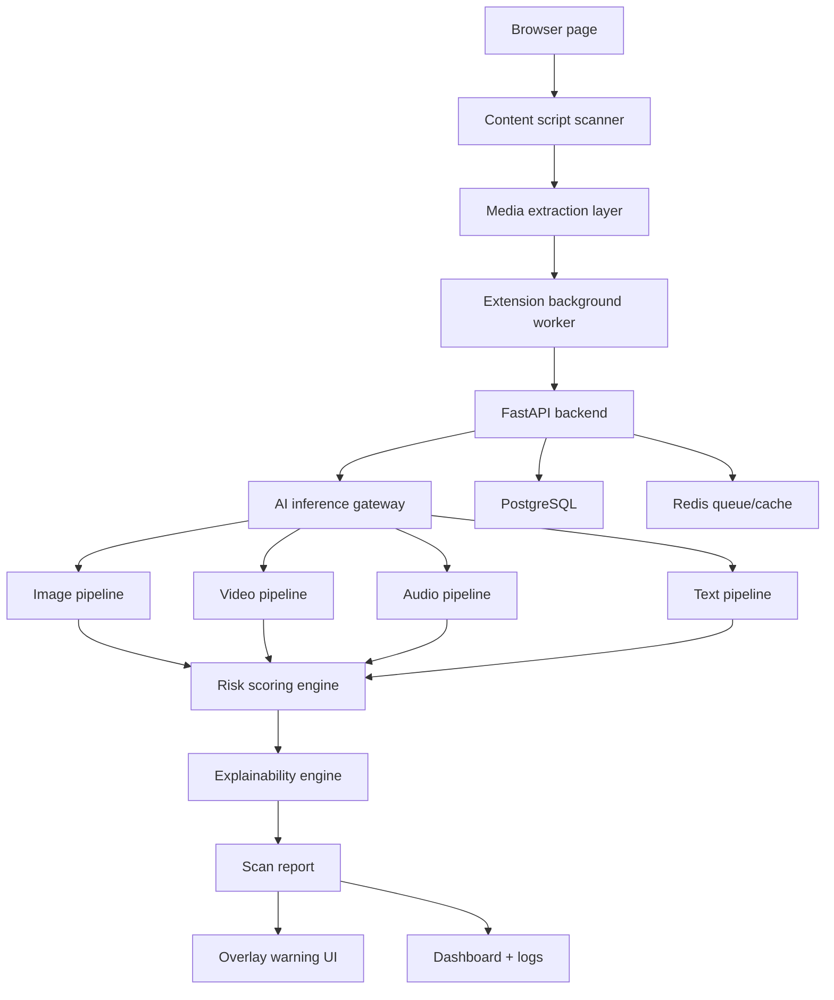

# GhostProof Architecture

## System Flow

## Service Boundaries

### Browser Extension

- Scans page DOM for image, video, audio, and text nodes.
- Sends compact scan requests to backend.
- Applies authenticity badges beside suspicious media.
- Supports context-menu scanning.
- Stores latest reports in Chrome local storage for popup dashboard.

### Backend API

- Owns public REST contract.
- Validates scan requests.
- Coordinates synchronous and async analysis.
- Persists scan reports and tamper-evident hashes.
- Exposes scan history for dashboard.
- Can call AI service remotely or run local in-process inference.

### AI Services

- Owns preprocessing, model registry, modality pipelines, and explainability.
- Supports fallback heuristic inference when model artifacts are absent.
- Designed for future ONNX/Torch model loading without API changes.

### Dashboard

- Security operations view for scan history.
- Presents evidence, confidence, modality scores, and trend timeline.
- Avoids binary "fake" claims. Shows risk, rationale, and uncertainty.

## Modality Pipelines

| Modality | Signals | Output |
| --- | --- | --- |
| Image | metadata, compression, frequency artifacts, lighting hints, model classifier | authenticity score, suspicious regions, reasons |
| Video | sampled frames, temporal variance, blink/lip sync hooks, frame heatmaps | deepfake probability, manipulated timestamps |
| Audio | mel features, harmonic stability, prosody proxy, speaker verification hook | cloned voice likelihood |
| Text | burstiness, entropy, repetition, semantic predictability, transformer hook | AI-generated probability, explanation |

## Risk Model

Each pipeline returns:

- `ai_probability`: probability of synthetic origin.
- `authenticity_score`: inverse risk on 0-100 scale.
- `confidence`: evidence quality and model certainty.
- `evidence`: structured reasons with severity, location, and remediation notes.

Risk engine combines modality scores using configurable weights and confidence penalties.

## Scalability Plan

- Split backend and AI service pods.
- Route heavy inference through Redis/Celery or Kafka workers.
- Cache repeated URL/media hashes.
- Store immutable scan reports in Postgres plus object storage for evidence assets.
- Add model registry with signed artifact manifests.
- Track per-model calibration, false-positive reports, and drift.
